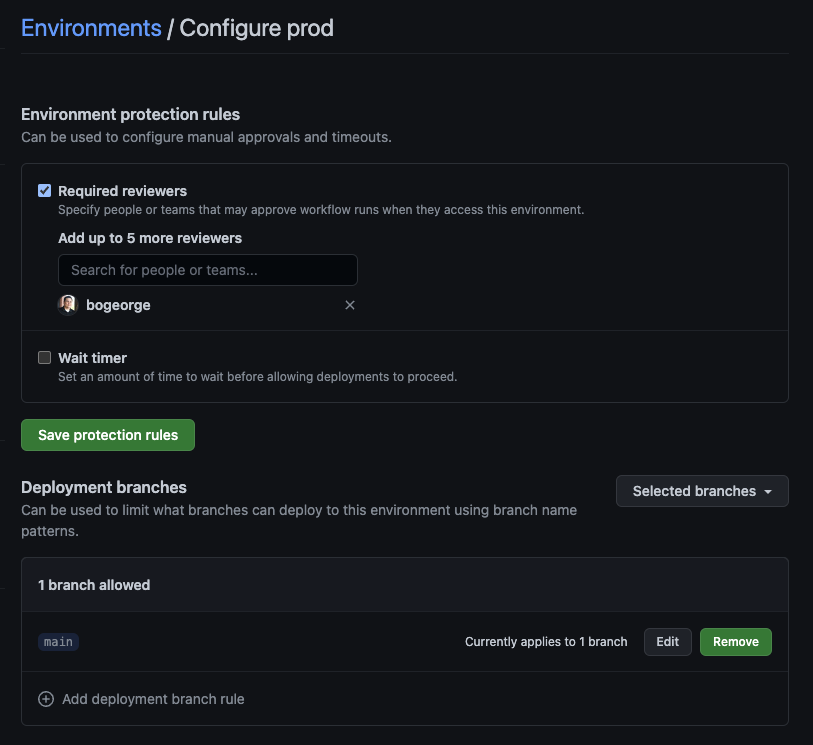
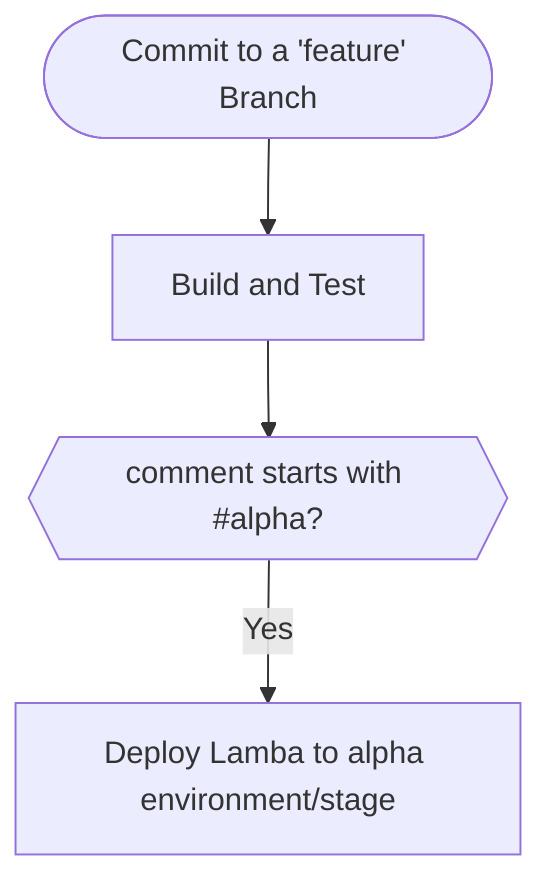
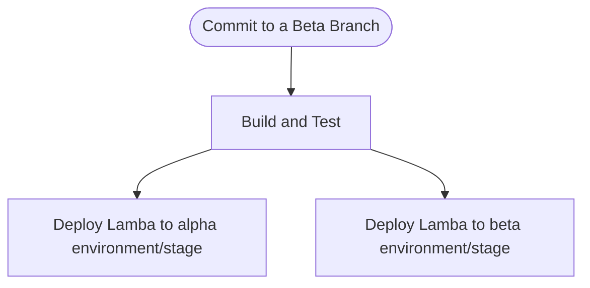
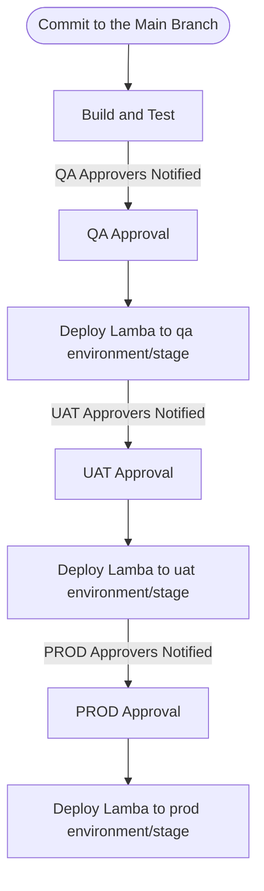

# CI/CD Overview
This is intended to outline the different pipeline executions that occur based on the branches being used, the github event triggered and any comments provided.

## Checklist
For the CI/CD Pipeline Process to work as intended there are a few things that need to be configured
* Ensure the environment variables you intend to use are available.  The key ones are  `*_AWS_ACCESS_KEY_ID` and `*_AWS_SECRET_ACCESS_KEY` where the * is the environment name (ALPHA, BETA, QA, UAT, PROD).  You may need to check with Matt, but this should be defined already at an Organization level.
* Set up a [github environment](https://docs.github.com/en/actions/deployment/targeting-different-environments/using-environments-for-deployment#creating-an-environment) for each deployable location (alpha, beta, qa, uat, prod)
* Then for environments that required protection (qa, uat and prod) setup protection rules
    * [Required Reviewers](https://docs.github.com/en/actions/deployment/targeting-different-environments/using-environments-for-deployment#required-reviewers) allow us to notify and have specific users approve before a deployment can occur
    * [Protected Branches](https://docs.github.com/en/actions/deployment/targeting-different-environments/using-environments-for-deployment#deployment-branches) allow us to ensure that deployments to an environment can only come from appropriate branches in our repo.  Main should be the only branch that allows deployment to qa, uat and prod.

Below is an example of having required approvers and branch protections for the prod environment.

## Reusable Workflows
Below is a list of resusable workflows used by the pipeline.  For now they are in this repo but long term they will likely move to their own dedicated repo with other reusable github workflows.

| Workflow | Purpose
| -------- | ----
| [Build and Test](build_yarn.yml) | Build, Test and Lint Code using Yarn
| [Deploy Lambda](deploy_lambda.yml) | Provided an environment parameter setup SAM CLI and deploy Lambda function

## [Development Pipeline](./pipeline_dev.yml)
Triggered on every 'push' commit to any branch other than 'main' or 'beta'.

Jobs:
1.  Execute **Build and Test** Workflow
2. __[Optional]__ Execute the **Deploy Lambda** Workflow to deploy your changes to the alpha environment

### Flow Diagram for Development Pipeline

## [Beta Pipeline](./pipeline_beta.yml)
Triggered on every 'push' commit to the beta branch. Typically as the result of an approved pull request from a dev branch into beta.

Jobs:
1. Execute **Build and Test** Workflow
2. Execute **Deploy Lambda** Workflow to deploy to both the alpha and beta environments (concurrently)

### Flow Diagram for Beta Pipeline

## [Main Pipeline](./pipeline_main.yml)
Triggered on every 'push' commit to the main branch. Typically as the result of an approved pull request from the beta branch into main.

Jobs:
1. Execute **Build and Test** Workflow
2. Execute **Deploy Lambda** Workflow to deploy to the qa environment
    * qa should be configured for approvals so execution won't complete until approved
3. Execute **Deploy Lambda** Workflow to deploy to the uat environment
    * this job depends on the qa deployment and won't try to run until that one completes successfully
    * uat should be configured for approvals so execution won't complete until approved
4. Execute **Deploy Lambda** Workflow to deploy to the prod environment
    * this job depends on the uat deployment and won't try to run until that one completes successfully
    * prod should be configured for approvals so execution won't complete until approved

### Flow Diagram for Main Pipeline

